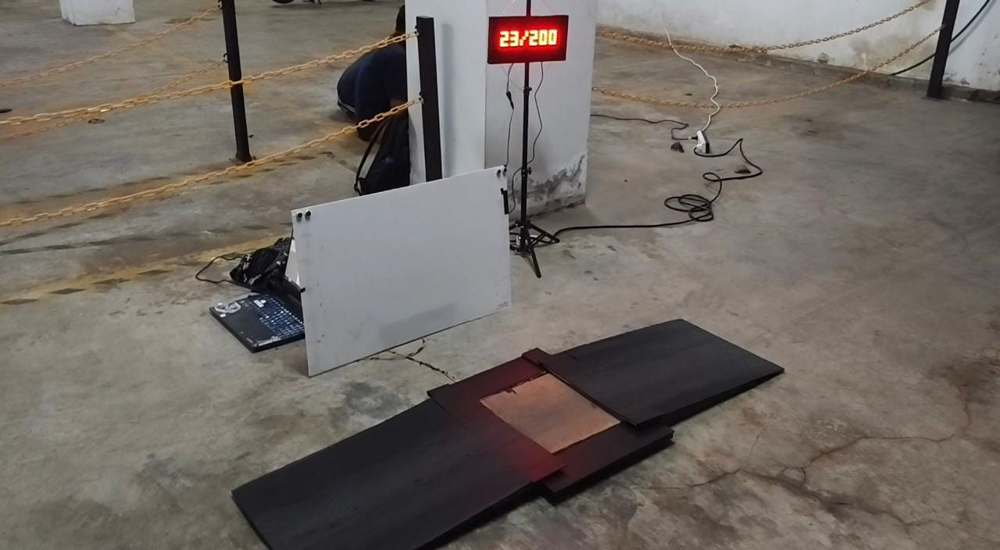
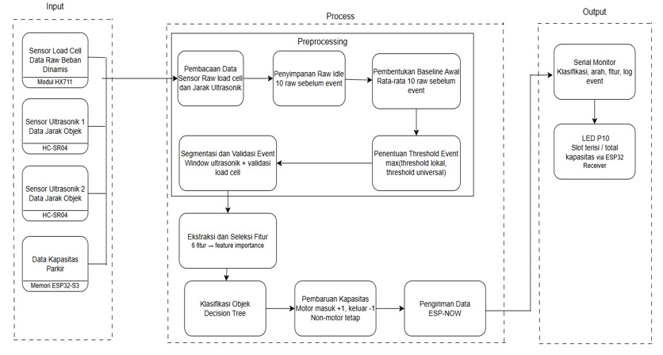
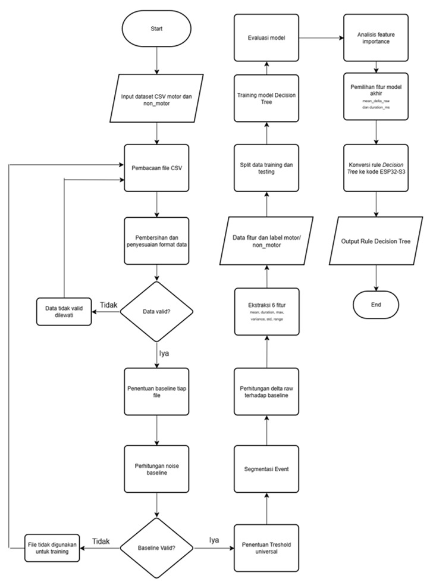

<div align="center">

# Klasifikasi Sepeda Motor Berbasis Sinyal Beban Dinamis

## Sistem Klasifikasi Sepeda Motor Berbasis Sinyal Beban Dinamis Menggunakan Metode Decision Tree pada Monitoring Parkir Satu Gerbang

### Proyek Skripsi Sarjana  
Program Studi Teknik Komputer — Fakultas Ilmu Komputer  
Universitas Brawijaya

<br>


<br>

[English Version](README.en.md)

</div>

---

## Ringkasan Proyek

Proyek ini dikembangkan sebagai kelanjutan dari Proyek Kerja Lapangan di Direktorat Teknologi Informasi Universitas Brawijaya (DTI UB). Latar belakang proyek ini berasal dari permasalahan monitoring parkir di lingkungan Universitas Brawijaya, khususnya ketidaksesuaian antara informasi kapasitas parkir yang ditampilkan dengan kondisi sebenarnya di lapangan.

Dalam beberapa kondisi, area parkir yang sebenarnya sudah penuh masih dapat dianggap tersedia, sehingga mahasiswa perlu menghabiskan waktu lebih lama untuk mencari tempat parkir. Sebaliknya, area parkir yang masih memiliki ruang kosong dapat terlihat seolah-olah penuh, sehingga pemanfaatan lahan parkir menjadi kurang efektif.

Untuk menjawab permasalahan tersebut, proyek ini mengembangkan prototipe sistem monitoring parkir satu gerbang yang mampu mengklasifikasikan objek yang melintas sebagai sepeda motor atau objek non-motor. Sistem memanfaatkan sinyal beban dinamis dari sensor load cell, sensor ultrasonik untuk mendukung deteksi arah, serta metode Decision Tree untuk proses klasifikasi.

Hasil klasifikasi dan deteksi arah digunakan untuk memperbarui informasi kapasitas parkir secara otomatis dan menampilkannya melalui LED P10.

---

## Tampilan Prototipe



Prototipe sistem terdiri dari platform pengukuran, sensor load cell, sensor ultrasonik, ESP32-S3 sebagai unit pemrosesan utama, ESP32 receiver, dan LED P10 sebagai media tampilan kapasitas parkir.

---

## Hasil Utama

| Pengujian | Hasil |
|---|---:|
| Akurasi model Decision Tree | 96,55% |
| Akurasi klasifikasi real-time | 91,82% |
| Akurasi deteksi arah | 97,27% |
| Akurasi perhitungan kapasitas parkir | 89,09% |

Hasil pengujian menunjukkan bahwa sistem dapat melakukan klasifikasi objek, mendeteksi arah pergerakan, dan memperbarui kapasitas parkir secara otomatis pada skenario pengujian yang telah dilakukan.

---

## Dokumentasi dan Publikasi

Dokumentasi proyek, slide presentasi, demo sistem, dan artikel publikasi dapat diakses melalui tautan berikut.

<p>
  <a href="https://canva.link/vgku0oqrcwyb0u5">
    
  </a>
</p>

<p>
  <a href="https://drive.google.com/drive/folders/1W88d7SP1vm2doo_kTv0_wtPjQow8c0Vc?usp=drive_link">
    
  </a>
</p>

<p>
  <a href="https://j-ptiik.ub.ac.id/index.php/j-ptiik/article/view/16677">
    
  </a>
</p>

Artikel jurnal digunakan sebagai dokumentasi akademik utama yang dapat diakses secara publik. Dokumen skripsi lengkap tidak disertakan langsung pada repositori ini.

---

## Judul Penelitian

**Sistem Klasifikasi Sepeda Motor Berbasis Sinyal Beban Dinamis Menggunakan Metode Decision Tree pada Monitoring Parkir Satu Gerbang**

---

## Tujuan Proyek

Tujuan dari proyek ini adalah membangun prototipe sistem yang mampu:

- membaca sinyal beban dinamis dari objek yang melintas,
- mengklasifikasikan objek sebagai sepeda motor atau non-motor,
- mendeteksi arah pergerakan objek,
- memperbarui kapasitas parkir secara otomatis,
- menampilkan informasi kapasitas parkir melalui LED P10.

---

## Fitur Utama

- Akuisisi sinyal beban dinamis menggunakan sensor load cell
- Pembacaan sensor load cell menggunakan modul HX711
- Validasi baseline dan deteksi event objek melintas
- Ekstraksi fitur dari nilai raw sensor load cell
- Klasifikasi sepeda motor dan objek non-motor menggunakan Decision Tree
- Implementasi rule klasifikasi secara real-time pada ESP32-S3
- Deteksi arah pergerakan menggunakan dua sensor ultrasonik
- Pembaruan kapasitas parkir menggunakan komunikasi ESP-NOW
- Penampilan informasi kapasitas parkir pada LED P10

---

## Arsitektur Sistem



Sistem terdiri dari ESP32-S3 sebagai unit utama, sensor load cell, modul HX711, sensor ultrasonik, komunikasi ESP-NOW, ESP32 receiver, dan LED P10 sebagai media tampilan.

```text
Objek Melintas
      ↓
Sensor Load Cell + HX711
      ↓
ESP32-S3
      ↓
Validasi Baseline + Deteksi Event
      ↓
Ekstraksi Fitur
      ↓
Klasifikasi Decision Tree
      ↓
Deteksi Arah
      ↓
Pembaruan Kapasitas Parkir
      ↓
Pengiriman Data ESP-NOW
      ↓
ESP32 Receiver + LED P10
```

---

## Alur Kerja Sistem

Secara umum, sistem bekerja melalui tahapan berikut:

1. Objek melewati platform pengukuran.
2. Sensor load cell membaca perubahan beban dalam bentuk nilai raw.
3. Sistem membandingkan pembacaan sensor terhadap baseline.
4. Ketika perubahan nilai melewati threshold, sistem mendeteksi adanya event objek melintas.
5. Data event digunakan untuk menghasilkan fitur sinyal.
6. Fitur tersebut diproses menggunakan rule Decision Tree.
7. Sistem menentukan apakah objek termasuk sepeda motor atau non-motor.
8. Sensor ultrasonik membantu menentukan arah masuk atau keluar.
9. Kapasitas parkir diperbarui berdasarkan hasil klasifikasi dan arah.
10. Informasi kapasitas dikirim ke ESP32 receiver dan ditampilkan pada LED P10.

---

## Komponen Perangkat Keras

| Komponen | Fungsi |
|---|---|
| ESP32-S3 | Unit utama untuk pembacaan sensor, pemrosesan data, klasifikasi, deteksi arah, dan pengiriman data |
| ESP32 Receiver | Unit penerima data untuk menampilkan kapasitas parkir |
| Sensor Load Cell | Membaca perubahan beban dinamis dari objek yang melintas |
| Modul HX711 | Menguatkan dan mengubah sinyal load cell menjadi data digital |
| Sensor Ultrasonik HC-SR04 | Mendeteksi keberadaan objek dan membantu menentukan arah pergerakan |
| LED P10 | Menampilkan informasi kapasitas parkir |
| Platform Pengukuran | Area lintasan objek saat proses pembacaan sensor dilakukan |

Dokumentasi perangkat keras tersedia pada folder [`hardware/`](hardware/).

---

## Alur Machine Learning



Model Decision Tree dilatih menggunakan fitur yang diekstraksi dari sinyal beban dinamis. Pipeline machine learning pada repositori ini didokumentasikan dalam bentuk pipeline Google Colab yang mencakup preprocessing, validasi baseline, penentuan threshold, ekstraksi fitur, pelatihan model, evaluasi, export rule, dan visualisasi hasil.

```text
Data Raw Load Cell
      ↓
Validasi Baseline
      ↓
Penentuan Threshold Universal
      ↓
Perhitungan Delta Raw
      ↓
Segmentasi Event
      ↓
Ekstraksi Fitur
      ↓
Pelatihan Decision Tree
      ↓
Evaluasi Model
      ↓
Konversi Rule ke ESP32-S3
```

---

## Fitur yang Digunakan

Fitur berikut digunakan untuk merepresentasikan karakteristik sinyal beban dinamis pada setiap event:

| Fitur | Keterangan |
|---|---|
| mean_delta_raw | Rata-rata perubahan sinyal selama event |
| max_delta_raw | Nilai maksimum perubahan sinyal selama event |
| variance_delta_raw | Variansi perubahan sinyal |
| std_delta_raw | Standar deviasi perubahan sinyal |
| range_delta_raw | Selisih nilai maksimum dan minimum sinyal |
| duration_ms | Durasi event dalam satuan milidetik |

---

## Model Klasifikasi

Model yang digunakan adalah Decision Tree dengan konfigurasi utama berikut.

| Parameter | Nilai |
|---|---|
| Criterion | entropy |
| Max depth | 3 |
| Random state | 42 |

Model yang telah dilatih kemudian dikonversi menjadi rule sederhana agar dapat diimplementasikan langsung pada ESP32-S3.

---

## Struktur Repositori

```text
data/        Dataset mentah, data event, hasil ekstraksi fitur, dan pembagian data
firmware/    Source code ESP32-S3 dan ESP32 receiver
hardware/    Dokumentasi perangkat keras, desain platform, skematik, dan wiring
media/       Gambar utama yang digunakan pada README
ml/          Pipeline Google Colab untuk preprocessing, training, evaluasi, dan visualisasi
```

---

## Isi Folder

### data/

Folder ini berisi data yang digunakan dalam proses klasifikasi. Data dapat mencakup data mentah hasil akuisisi sensor, data event yang sudah dipotong, dataset hasil ekstraksi fitur, serta informasi pembagian data training dan testing.

### firmware/

Folder ini berisi source code mikrokontroler yang digunakan pada prototipe sistem, yaitu program utama ESP32-S3 dan program ESP32 receiver untuk tampilan LED P10.

```text
firmware/
├── esp32-s3-main/
└── esp32-receiver-led-p10/
```

### hardware/

Folder ini berisi dokumentasi perangkat keras, seperti desain platform load cell, desain papan sensor ultrasonik, skematik sistem, wiring, dan foto prototipe.

### media/

Folder ini berisi gambar utama yang ditampilkan pada README.

```text
media/
├── prototype.jpeg
├── system-architecture.jpeg
└── ml-pipeline.jpeg
```

### ml/

Folder ini berisi pipeline Google Colab yang digunakan untuk proses preprocessing, ekstraksi fitur, pelatihan model Decision Tree, evaluasi model, export rule, dan visualisasi hasil.

---

## Catatan Dataset

Dataset pada repositori ini digunakan untuk mendukung dokumentasi dan reproduksi proses machine learning. Data yang dipublikasikan telah dipilih agar tetap relevan dengan kebutuhan proyek.

Dataset penuh atau data mentah yang tidak diperlukan tidak harus disertakan seluruhnya. Data yang tersedia pada folder `data/` digunakan untuk menunjukkan alur pengolahan data, mulai dari data sensor, segmentasi event, ekstraksi fitur, hingga evaluasi model.

---

## Cara Memahami Repositori

Repositori ini dapat dipahami melalui urutan berikut:

1. Baca ringkasan proyek pada README ini.
2. Lihat demo sistem melalui tautan Google Drive.
3. Baca artikel jurnal sebagai dokumentasi akademik utama.
4. Lihat folder `hardware/` untuk memahami rancangan perangkat keras.
5. Lihat folder `firmware/` untuk memahami implementasi mikrokontroler.
6. Lihat folder `data/` untuk memahami format data yang digunakan.
7. Lihat folder `ml/` untuk memahami proses preprocessing, ekstraksi fitur, training, evaluasi, dan visualisasi model.

---

## Status Proyek

Proyek ini telah diselesaikan sebagai proyek skripsi sarjana.

Pengembangan lanjutan yang dapat dilakukan:

- penambahan jumlah dataset,
- pengujian dengan variasi sepeda motor dan objek non-motor yang lebih banyak,
- perbaikan desain mekanik platform,
- integrasi dengan dashboard monitoring berbasis web atau cloud,
- perbandingan dengan metode klasifikasi lain,
- pengembangan sistem monitoring parkir yang terhubung langsung dengan sistem informasi kampus.

---

## Penulis

**Zidan Fadil Yahya**  
Program Studi Teknik Komputer  
Fakultas Ilmu Komputer  
Universitas Brawijaya

---

## Lisensi

Source code pada repositori ini menggunakan MIT License.

Artikel jurnal, slide presentasi, gambar, dataset, dan materi akademik tetap menjadi milik akademik penulis. Dokumen skripsi lengkap tidak dipublikasikan langsung pada repositori ini.
